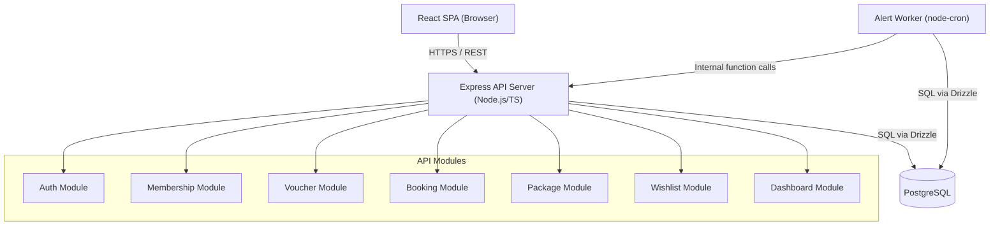
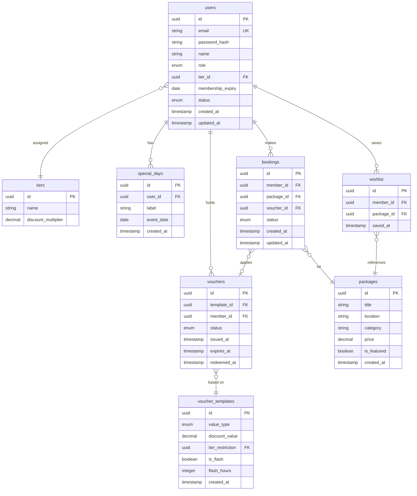

# Design Document: Holiday Membership Application

## Overview

The Holiday Membership Application is a private, role-gated platform for managing luxury travel memberships, vouchers, and bookings. It serves three user roles — Member, Operations, and Admin — and automates marketing triggers via a background worker.

The design prioritises a lightweight, cost-effective stack: a single Node.js/TypeScript server with a PostgreSQL database, a React SPA for the frontend, and a simple cron-based background worker. This avoids the operational overhead of microservices while keeping service boundaries clean enough to extract later if needed.

**Tech Stack**

- Backend: Node.js + TypeScript (Express)
- Database: PostgreSQL (hosted on a managed tier, e.g. Supabase free/pro or Railway)
- Frontend: React + TypeScript (Vite)
- Auth: JWT (short-lived access tokens + refresh tokens stored in httpOnly cookies)
- Background Worker: Node.js cron job (node-cron) running in the same process or a lightweight separate dyno
- ORM: Drizzle ORM (lightweight, type-safe, no heavy runtime)
- Hosting: Single server / PaaS (e.g. Railway, Render, or Fly.io free tier)

---

## Architecture

The system is a modular monolith. All domain logic is separated into service modules with clear interfaces, but deployed as a single process. This keeps infrastructure costs near zero while preserving the ability to split services later.



**Request flow:**
1. React SPA sends REST requests with a JWT Bearer token.
2. Express middleware validates the token and attaches the decoded user (id, role) to the request context.
3. Route handlers delegate to the relevant service module.
4. Service modules interact with the database via Drizzle ORM.
5. The Alert Worker runs on a 24-hour cron schedule, queries the database directly, and calls Voucher/Dashboard service functions.

---

## Components and Interfaces

### Auth Module

Responsible for login, session management, and RBAC middleware.

```
POST /auth/login          → { accessToken, user }
POST /auth/refresh        → { accessToken }
POST /auth/logout         → 200 OK
```

Middleware: `requireAuth(roles: Role[])` — validates JWT and checks role membership. Returns 401 for invalid/expired tokens, 403 for insufficient role.

### Membership Module

```
POST   /members                    (Ops) → create member
GET    /members/:id                (Ops/Admin) → get member profile
PATCH  /members/:id                (Ops) → update member metadata
GET    /members/me                 (Member) → own profile
GET    /members/me/special-days    (Member) → list special days
POST   /members/me/special-days    (Member) → add special day
PATCH  /members/me/special-days/:id (Member) → edit special day
DELETE /members/me/special-days/:id (Member) → delete special day
```

### Voucher Module

```
POST /voucher-templates            (Admin) → create template
POST /vouchers/assign              (Ops) → assign to member
POST /vouchers/bulk-assign         (Ops/Admin) → assign to tier
GET  /vouchers/me                  (Member) → wallet view
POST /vouchers/:id/apply           (Member) → apply to booking
```

### Booking Module

```
POST  /bookings                    (Member) → submit request
GET   /bookings/me                 (Member) → booking history
PATCH /bookings/:id/status         (Ops) → update status
```

### Package Module

```
GET   /packages                    (Member/Ops) → search/browse
POST  /packages                    (Admin) → create package
PATCH /packages/:id                (Admin) → update (incl. featured flag)
```

### Wishlist Module

```
POST   /wishlist/:packageId        (Member) → add to wishlist
DELETE /wishlist/:packageId        (Member) → remove from wishlist
GET    /wishlist                   (Member) → view wishlist
```

### Dashboard Module

```
GET /dashboard/lookahead           (Ops) → 30-day special day alerts
GET /dashboard/bi                  (Admin) → full BI metrics
```

### Alert Worker

Runs via `node-cron` on a `0 2 * * *` schedule (2 AM daily). Executes two tasks:
1. **Special Day Scan**: Finds members with a Special Day in the next 30 days, issues Gift Vouchers if not already issued for that cycle.
2. **Expiry Scan**: Flags memberships expiring within 60 days (updates a `expiring_soon` flag or is computed on read).

---

## Data Models



**Key design decisions:**

- `voucher_templates` holds the reusable definition; `vouchers` holds per-member instances with their own lifecycle state.
- `special_days` stores the raw date (month + day only for recurring events, or full date for one-off). The worker computes the next occurrence.
- `bookings.voucher_id` is nullable — not all bookings use a voucher.
- Passwords are stored as bcrypt hashes only; never plaintext.
- UUIDs used as primary keys throughout to avoid enumeration attacks.


---

## Correctness Properties

*A property is a characteristic or behavior that should hold true across all valid executions of a system — essentially, a formal statement about what the system should do. Properties serve as the bridge between human-readable specifications and machine-verifiable correctness guarantees.*

### Property 1: Valid login returns role-scoped token

*For any* user with valid credentials, calling the login endpoint should return a token that, when decoded, contains the user's correct role and user ID.

**Validates: Requirements 1.1**

---

### Property 2: Unauthorized role access returns 403

*For any* protected endpoint and any user whose role does not have permission to access it, the response status must be 403 Forbidden.

**Validates: Requirements 1.2, 1.3**

---

### Property 3: Invalid or expired token returns 401

*For any* protected endpoint and any request carrying an expired, malformed, or missing token, the response status must be 401 Unauthorized.

**Validates: Requirements 1.5**

---

### Property 4: Member creation round-trip

*For any* valid set of member details (email, name, tier, expiry date), creating a member and then fetching that member should return a record with Active status and all submitted fields intact.

**Validates: Requirements 2.1, 2.2**

---

### Property 5: Duplicate email rejected

*For any* email address already registered in the system, a second creation attempt with that email must be rejected with an error response.

**Validates: Requirements 2.5**

---

### Property 6: Member update round-trip

*For any* existing member and any valid update payload (duration, tier, status), applying the update and then fetching the member should return the new values along with a non-null updated_at timestamp greater than the previous one.

**Validates: Requirements 2.3, 2.4**

---

### Property 7: Profile response completeness

*For any* member, fetching their profile must return a response that includes tier name, membership expiry date, and account status — all non-null.

**Validates: Requirements 3.1**

---

### Property 8: Expiry-soon flag correctness

*For any* member, the "Expiring Soon" flag must be true if and only if the membership expiry date is within 60 days of the current date. For any member with an expiry beyond 60 days, the flag must be false.

**Validates: Requirements 3.3**

---

### Property 9: Special days count invariant

*For any* member who already has 4 Special Days, any attempt to add a fifth must be rejected, and the count of Special Days for that member must remain exactly 4.

**Validates: Requirements 4.1, 4.3**

---

### Property 10: Special day addition round-trip

*For any* member with fewer than 4 Special Days, adding a new Special Day with a label and date and then fetching the member's Special Days should return a list that includes the newly added entry with matching label and date.

**Validates: Requirements 4.2**

---

### Property 11: Worker issues gift voucher for upcoming special days

*For any* member with a Special Day falling within the next 30 days, after the Alert Worker's evaluation cycle runs, that member's voucher wallet must contain at least one Gift Voucher in Issued status that was not present before the cycle.

**Validates: Requirements 4.5**

---

### Property 12: Worker populates lookahead dashboard

*For any* set of members, after the Alert Worker runs, the Lookahead Dashboard must contain exactly those members whose Special Day falls within the next 30 days, sorted by date ascending, and must not contain members whose Special Day is outside that window.

**Validates: Requirements 4.6, 9.1**

---

### Property 13: Lookahead response shape completeness

*For any* entry returned by the Lookahead Dashboard, the response must include the member's name, the Special Day label, the Special Day date, and the number of days remaining — all non-null.

**Validates: Requirements 9.2**

---

### Property 14: Voucher template creation round-trip

*For any* valid voucher template (value type, discount value, optional tier restriction), creating the template and then fetching it should return a record with all submitted fields intact.

**Validates: Requirements 5.2**

---

### Property 15: Voucher assignment creates Issued instance

*For any* member and any voucher template, assigning the voucher to the member must create a new voucher instance with status Issued associated with that member.

**Validates: Requirements 5.3**

---

### Property 16: Bulk assignment count invariant

*For any* tier with N members, bulk-assigning a voucher template to that tier must create exactly N new voucher instances, one per member, each in Issued status.

**Validates: Requirements 5.4**

---

### Property 17: Voucher lifecycle state machine

*For any* voucher instance, only the following state transitions are valid: Issued → Pending, Pending → Redeemed, Pending → Issued (on booking cancellation), and Issued → Expired (on expiry). Any attempt to perform an invalid transition must be rejected.

**Validates: Requirements 5.5, 8.3, 8.5, 8.6**

---

### Property 18: Expired voucher status update

*For any* voucher whose expiry date has passed and whose status is not Redeemed, after the expiry check runs, the voucher's status must be Expired.

**Validates: Requirements 5.6**

---

### Property 19: Flash voucher expiry calculation

*For any* Flash Voucher with a configured flash_hours value, the voucher's expires_at timestamp must equal issued_at plus flash_hours (within a tolerance of 1 second for processing time).

**Validates: Requirements 5.7**

---

### Property 20: Wallet groups vouchers by status

*For any* member with vouchers in multiple lifecycle states, fetching the wallet must return all voucher instances for that member, and each voucher must appear in the group corresponding to its current status.

**Validates: Requirements 5.8**

---

### Property 21: Tier-locked voucher redemption restriction

*For any* Tier-Locked voucher and any member whose current tier does not match the voucher's tier restriction, an attempt to redeem that voucher must be rejected.

**Validates: Requirements 5.9**

---

### Property 22: Search filter correctness

*For any* search query with one or more filters (location, category, price point), every package returned must satisfy all applied filter criteria, and no package that satisfies all criteria must be omitted.

**Validates: Requirements 6.2**

---

### Property 23: Featured packages ordering invariant

*For any* search or browse result set containing both featured and non-featured packages, all featured packages must appear before all non-featured packages in the response.

**Validates: Requirements 6.3, 6.4, 6.5**

---

### Property 24: Wishlist add and remove round-trip

*For any* member and any package, adding the package to the wishlist and then fetching the wishlist must include that package. Removing the package and then fetching the wishlist must not include that package.

**Validates: Requirements 7.1, 7.2, 7.3**

---

### Property 25: Wishlist add idempotence

*For any* member and any package already in their wishlist, adding the same package again must not create a duplicate entry — the wishlist count for that member must remain unchanged.

**Validates: Requirements 7.4**

---

### Property 26: Wishlist count aggregation

*For any* set of wishlist entries, the aggregated save count per package returned by the BI Dashboard must equal the actual number of wishlist entries for that package in the database.

**Validates: Requirements 7.5, 10.3**

---

### Property 27: Booking creation round-trip

*For any* member and any package, submitting a booking request and then fetching the member's booking history must include a booking record with status New Request, the correct package, and the correct member association.

**Validates: Requirements 8.1, 8.7**

---

### Property 28: Voucher validation on booking

*For any* booking request that applies a voucher, if the voucher is not in Issued status or does not belong to the requesting member, the booking must be rejected.

**Validates: Requirements 8.2**

---

### Property 29: Booking status update round-trip

*For any* booking and any valid status transition performed by an Operations user, fetching the booking after the update must reflect the new status and a non-null updated_at timestamp.

**Validates: Requirements 8.4**

---

### Property 30: Booking state machine

*For any* booking, only the following state transitions are valid: New Request → In Review, In Review → Confirmed, In Review → Cancelled. Any attempt to perform a transition not in this set must be rejected.

**Validates: Requirements 8.8**

---

### Property 31: BI booking count aggregation

*For any* set of confirmed bookings, the monthly and yearly booking counts returned by the BI Dashboard must equal the actual count of confirmed bookings in those respective time periods.

**Validates: Requirements 10.1**

---

### Property 32: Voucher redemption rate calculation

*For any* set of vouchers grouped by value type, the redemption rate returned by the BI Dashboard must equal (count of Redeemed vouchers / count of total Issued vouchers) × 100 for each type, within floating-point tolerance.

**Validates: Requirements 10.4**

---

## Error Handling

**Authentication errors**
- Invalid credentials → 401 with generic message (no user enumeration)
- Expired token → 401 with `token_expired` code so clients can trigger refresh
- Insufficient role → 403 with `forbidden` code

**Validation errors**
- Missing required fields → 400 with field-level error details
- Duplicate email on member creation → 409 Conflict
- Special day limit exceeded → 422 Unprocessable Entity
- Invalid state transition (booking, voucher) → 422 with current state and allowed transitions in response body

**Business rule violations**
- Tier-locked voucher applied by wrong tier → 403 with descriptive message
- Voucher not in Issued status on booking → 409 with current voucher status
- Duplicate wishlist entry → 200 with `already_saved: true` (not an error, idempotent)

**Worker failures**
- Alert Worker catches all exceptions, logs `{ timestamp, error, cycle }` to a `worker_logs` table, and schedules a retry after 5 minutes using a simple setTimeout.
- Worker failures do not crash the main server process.

**Database errors**
- All service functions wrap DB calls in try/catch; unexpected DB errors return 500 with a correlation ID for log tracing.

---

## Testing Strategy

### Dual Testing Approach

Both unit tests and property-based tests are required. They are complementary:
- Unit tests catch concrete bugs at specific inputs and verify integration points.
- Property tests verify universal correctness across randomised inputs.

**Unit tests focus on:**
- Specific examples (e.g., creating a member with known data and asserting exact response shape)
- Integration points between modules (e.g., booking confirmation triggering voucher state change)
- Edge cases and error conditions (e.g., expired token, duplicate email, invalid state transition)

**Property tests focus on:**
- Universal properties from the Correctness Properties section above
- Comprehensive input coverage through randomisation

### Property-Based Testing Library

**Language**: TypeScript  
**Library**: [fast-check](https://github.com/dubzzz/fast-check)

fast-check is the standard PBT library for TypeScript/JavaScript. It provides arbitraries for generating random inputs and shrinks failing cases to minimal counterexamples.

Each property test must run a minimum of **100 iterations** (fast-check default is 100; set explicitly via `{ numRuns: 100 }`).

### Property Test Tagging

Each property test must include a comment referencing the design property it validates:

```typescript
// Feature: holiday-membership-app, Property 8: Expiry-soon flag correctness
it('flags memberships expiring within 60 days', () => {
  fc.assert(
    fc.property(memberArbitrary, (member) => {
      const daysUntilExpiry = differenceInDays(member.membershipExpiry, new Date());
      const flag = computeExpirySoonFlag(member);
      return daysUntilExpiry <= 60 ? flag === true : flag === false;
    }),
    { numRuns: 100 }
  );
});
```

Tag format: `Feature: holiday-membership-app, Property {number}: {property_text}`

### Test Structure

```
src/
  __tests__/
    unit/
      auth.test.ts          # Properties 1, 2, 3
      membership.test.ts    # Properties 4–10
      voucher.test.ts       # Properties 14–21
      booking.test.ts       # Properties 27–30
      package.test.ts       # Properties 22–23
      wishlist.test.ts      # Properties 24–26
      dashboard.test.ts     # Properties 31–32
      worker.test.ts        # Properties 11–13, 18
```

### Unit Test Examples (non-property)

- Verify the three default tiers (Silver, Gold, Platinum) exist with non-null discount multipliers (Requirement 3.2)
- Verify all four voucher value types (Cashback, Seasonal, Tier-Locked, Free-Night) can be created (Requirement 5.1)
- Verify passwords are stored as bcrypt hashes (never plaintext) by inspecting the stored value format (Requirement 11.1)
- Simulate a worker failure and verify a log entry is written to `worker_logs` with a timestamp (Requirement 11.4)
